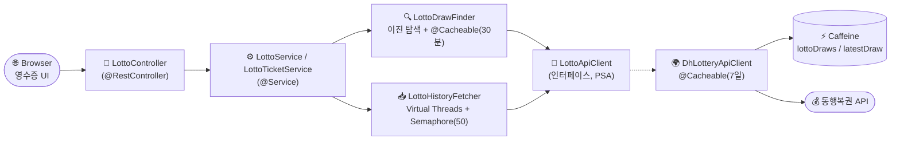

<div align="center">

# 🎰 Lotto Generator

**동행복권 API와 연동되는 Spring Boot 기반 로또 번호 생성기 REST API**

역대 당첨번호를 제외한 고유 조합 생성 · 영수증 형태 발권 · 가상 스레드 기반 고성능 수집

[](https://openjdk.org/projects/jdk/21/)
[](https://spring.io/projects/spring-boot)
[](https://gradle.org/)
[](https://docs.gradle.org/current/userguide/kotlin_dsl.html)
[](https://github.com/ben-manes/caffeine)

</div>

---

## 📑 목차

- [✨ 주요 특징](#-주요-특징)
- [🚀 빠른 시작](#-빠른-시작)
- [🛠 기술 스택](#-기술-스택)
- [🏛 아키텍처](#-아키텍처)
- [🎯 스프링 5원칙 적용](#-스프링-5원칙-적용)
- [🧠 핵심 설계](#-핵심-설계)
- [📁 패키지 구조](#-패키지-구조)
- [⚙️ 설정](#️-설정)
- [🔌 API 명세](#-api-명세)
- [🖥 프론트엔드](#-프론트엔드)
- [▶️ 실행](#️-실행)

---

## ✨ 주요 특징

| | |
|---|---|
| 🧵 **Java 21 Virtual Threads** | 회차별 fan-out 수집을 가상 스레드로 처리, Semaphore(50)로 외부 API 동시성 제한 |
| 🔍 **이진 탐색 최신 회차 탐지** | `searchStart=1100`에서 출발해 O(log n) 호출로 최신 회차 확정, 결과 30분 캐시 |
| 🚫 **역대 당첨번호 제외 생성** | 1,100여 회차 누적 당첨 조합과 대조하여 고유 번호만 반환 |
| 🧾 **영수증 발권 모드** | 동행복권 영수증 포맷으로 게임 라벨(A~AX)·발행시각·청구마감일 포함 |
| ⚡ **Caffeine 이중 TTL 캐시** | 추첨 결과 7일 보관 + 최신 회차 30분 TTL로 불필요한 재탐색 완전 차단 |
| 🛡 **시작 시 설정 검증** | `@Validated` 제약으로 잘못된 yml 설정 시 애플리케이션 기동 즉시 실패 |
| 🎱 **실제 복권 공 UI** | 번호 범위별 색상 코딩(황금·파랑·빨강·회색·초록) + 다크 모드 + 자동 재발권 |
| 📋 **RFC 7807 표준 오류** | `ProblemDetail` 기반 일관된 에러 응답 |
| ♿ **접근성 친화 UI** | `aria-busy`·`role="alert"`·`:focus-visible`·XSS 안전 정적 프론트엔드 |

---

## 🚀 빠른 시작

```powershell
# 1) 빌드 + 실행
./gradlew.bat bootRun

# 2) 브라우저에서 영수증 UI 열기
# http://localhost:8080/

# 3) 또는 API 직접 호출
curl "http://localhost:8080/api/lotto/ticket?games=5"
```

> 💡 빠른 티켓 발권은 외부 API를 호출하지 않고 즉시 응답합니다.  
> 역대 당첨 제외 모드(`skipHistory=false`)는 동행복권 API 호출이 발생해 첫 호출 시 수 초가 소요될 수 있습니다.

---

## 🛠 기술 스택

| 항목 | 버전 / 사양 |
|---|---|
| **Java** | 21 LTS (Virtual Threads, Records) |
| **Spring Boot** | 4.0.6 |
| **Spring Framework** | 6.x |
| **Build** | Gradle 9.4.1 (Kotlin DSL) |
| **HTTP Client** | Spring `RestClient` + JDK HttpClient (HTTP/2) |
| **Cache** | Spring Cache + **Caffeine** (이중 TTL: 7일 / 30분) |
| **Validation** | Jakarta Bean Validation (`@Validated` 설정 검증) |
| **Lombok** | `@RequiredArgsConstructor` 생성자 주입, `@Slf4j` 로깅 |

---

## 🏛 아키텍처



요청 흐름은 컨트롤러 → 서비스 파사드 → (회차 탐색기 / 이력 수집기) → 추상화된 API 클라이언트 → Caffeine 캐시 → 동행복권 어댑터 순으로 단방향 의존을 유지합니다.

---

## 🎯 스프링 5원칙 적용

### 1️⃣ IoC — Inversion of Control
`@SpringBootApplication` + `@ConfigurationPropertiesScan` 조합으로 컴포넌트 탐색을 Spring 컨테이너에 위임.

### 2️⃣ DI — Dependency Injection
Lombok `@RequiredArgsConstructor` 기반 **생성자 주입**. 모든 의존성을 `final`로 선언해 불변성을 강제합니다.

```java
@Service
@RequiredArgsConstructor
public class LottoService {
    private final LottoDrawFinder lottoDrawFinder;
    private final LottoHistoryFetcher lottoHistoryFetcher;
    private final LottoNumberGenerator lottoNumberGenerator;
}
```

### 3️⃣ AOP — Aspect-Oriented Programming
`@Cacheable`로 API 응답과 최신 회차 탐색 결과를 횡단 관심사로 분리. 캐시 히트 시 HTTP 호출·이진 탐색 완전 생략.

```java
// 추첨 결과: 7일 TTL (결과는 영구 불변)
@Cacheable(cacheNames = "lottoDraws", unless = "#result == null || !#result.isPresent()")
public Optional<LottoDrawResponse> fetchDraw(int drawNo) { ... }

// 최신 회차: 30분 TTL (매주 토요일 갱신 주기 반영)
@Cacheable(cacheNames = "latestDraw")
public int findLatestDraw() { ... }
```

### 4️⃣ PSA — Portable Service Abstraction
`LottoApiClient` 인터페이스로 외부 API 의존성을 추상화(DIP). 구현체 `DhLotteryApiClient`를 교체해도 서비스 계층은 무변경. HTTP 통신 자체도 Spring `RestClient`라는 PSA를 활용.

### 5️⃣ POJO — Plain Old Java Object
도메인 모델(`LottoNumbers`, `LottoTicket`, `TicketGame`)을 Java **record**(불변 POJO)로 표현해 부수효과 없는 값 객체로 설계. `@ConfigurationProperties`도 record로 선언해 일관성 유지.

---

## 🧠 핵심 설계

### ⚡ Caffeine 이중 TTL 캐시 전략

캐시 대상별로 생존 주기가 다르므로 `CaffeineCacheManager`로 캐시를 분리 구성합니다.

| 캐시 이름 | TTL | 최대 항목 | 근거 |
|---|---|---|---|
| `lottoDraws` | **7일** | 2,000 | 추첨 결과는 발표 후 영구 불변 |
| `latestDraw` | **30분** | 1 | 매주 토요일 추첨 — 30분마다 자동 갱신 |

```java
manager.registerCustomCache("lottoDraws",
    Caffeine.newBuilder().maximumSize(2000).expireAfterWrite(Duration.ofDays(7)).build());
manager.registerCustomCache("latestDraw",
    Caffeine.newBuilder().maximumSize(1).expireAfterWrite(Duration.ofMinutes(30)).build());
```

### 🧵 Virtual Threads + Semaphore 기반 fan-out

역대 당첨번호 수집 시 회차별로 가상 스레드를 할당하되, **Semaphore(50)** 으로 외부 API 동시 요청 수를 제한하여 동행복권 서버 과부하를 방지합니다.

```text
LottoHistoryFetcher
  └─ Executors.newVirtualThreadPerTaskExecutor()
       ├─ Semaphore(MAX_CONCURRENT = 50)  ← 동시성 제어
       └─ @Cacheable(lottoDraws, 7일)     ← 재호출 비용 제거
```

> 가상 스레드는 1,000개 이상 생성해도 부담이 없지만, 외부 API 서버 보호를 위해 동시 호출 수는 별도 제한합니다.

### 🔍 이진 탐색으로 최신 회차 탐지

`LottoDrawFinder`는 `searchStart=1100`에서 출발해 상한을 지수적으로 확장한 뒤, **이진 탐색으로 O(log n)** API 호출만으로 최신 회차를 확정합니다. 결과는 30분간 캐시되어 반복 탐색을 차단합니다.

```text
[1100] → 200 OK → 상한 확장 (1200, 1400, 1800, ...)
                       ↓
                  최초 404 발견
                       ↓
              [last_ok, first_404] 구간 이진 탐색
                       ↓
                   최신 회차 확정 → Caffeine latestDraw 30분 캐시
```

### 🚫 역대 당첨번호 제외 번호 생성

`LottoService.generateUnique()`는 역대 당첨번호 `Set`(불변 `Set.copyOf()`)과 대조하며 중복 없는 고유 조합만 반환합니다. 안전 한도(`count × 1000`회)를 초과하면 `IllegalStateException`을 던져 무한 루프를 방지합니다.

### 🛡 시작 시 설정 자동 검증

`LottoProperties`에 `@Validated`를 적용해 잘못된 설정 값이 있을 경우 애플리케이션 기동 단계에서 즉시 실패합니다.

```java
@ConfigurationProperties(prefix = "lotto")
@Validated
public record LottoProperties(
    @Valid @NotNull Api api,
    @Valid @NotNull Draw draw, ...
) {
    public record Api(
        @NotBlank String baseUrl,
        @NotNull Duration connectTimeout, ...
    ) {}
    public record Draw(@Min(1) int searchStart, @Min(1) int searchStep) {}
}
```

### 📋 RFC 7807 표준 오류 응답

`GlobalExceptionHandler`(`@RestControllerAdvice`)가 모든 예외를 `ProblemDetail`로 변환합니다.

```json
{
  "type": "urn:problem-type:lotto/bad-request",
  "title": "잘못된 요청",
  "status": 400,
  "detail": "게임 수는 1 이상이어야 합니다."
}
```

---

## 📁 패키지 구조

```
com.lotto
├── LottoApplication              # 부트 진입점, @ConfigurationPropertiesScan
│
├── config/
│   ├── LottoProperties           # @ConfigurationProperties record + @Validated
│   └── RestClientConfig          # @EnableCaching, RestClient, CaffeineCacheManager
│
├── client/
│   ├── LottoApiClient            # 인터페이스 (DIP)
│   ├── DhLotteryApiClient        # 동행복권 HTTP 어댑터, @Cacheable(lottoDraws, 7일)
│   └── dto/
│       └── LottoDrawResponse     # API 응답 record DTO
│
├── domain/
│   ├── LottoNumbers              # 불변 값 객체 record (6개 번호 + 검증)
│   ├── LottoNumberGenerator      # 무작위 번호 생성 @Component
│   ├── PickMode                  # MANUAL / AUTO enum
│   ├── TicketGame                # 게임 한 줄 record
│   ├── LottoTicket               # 영수증 도메인 record
│   └── ReceiptNumberGenerator    # 영수증 번호 생성 @Component
│
├── service/
│   ├── LottoDrawFinder           # 최신 회차 이진 탐색 + @Cacheable(latestDraw, 30분)
│   ├── LottoHistoryFetcher       # 역대 당첨번호 fan-out 수집, Set.copyOf() 반환
│   ├── LottoService              # 고유 번호 생성 Facade @Service
│   └── LottoTicketService        # 티켓 발권 @Service
│
└── controller/
    ├── LottoController           # REST 엔드포인트, Optional.ofNullable 기본값 처리
    ├── GlobalExceptionHandler    # @RestControllerAdvice, ProblemDetail
    └── dto/
        ├── GenerateLottoResponse # 번호 생성 응답 record
        └── TicketResponse        # 영수증 응답 record (Locale.KOREAN 고정)
```

---

## ⚙️ 설정

`application.yml` — 모든 값은 `LottoProperties` record에 `@ConfigurationProperties(prefix="lotto")`로 **타입 안전하게 바인딩**되며, `@Validated`로 기동 시 검증됩니다.

```yaml
spring:
  application:
    name: lotto-generator
  threads:
    virtual:
      enabled: true          # Spring MVC 요청 처리도 가상 스레드 사용
  jackson:
    default-property-inclusion: non_null
    serialization:
      indent-output: false

server:
  port: 8080
  compression:
    enabled: true
    mime-types: application/json,application/problem+json
    min-response-size: 1024

lotto:
  api:
    base-url: https://www.dhlottery.co.kr/common.do
    connect-timeout: 3s
    read-timeout: 5s
  draw:
    search-start: 1100     # 탐색 시작 회차 (이 값 미만은 항상 유효하다고 가정)
    search-step: 100
  generator:
    default-count: 5
    max-count: 50
    number-min: 1
    number-max: 45
    pick-size: 6
  ticket:
    price-per-game: 1000
    claim-validity-days: 365
```

> 캐시(`lottoDraws` / `latestDraw`) TTL은 `RestClientConfig`의 `CaffeineCacheManager` 빈에서 코드로 관리합니다.

---

## 🔌 API 명세

### `GET /api/lotto/generate` — 번호 생성 (역대 당첨 제외)

```http
GET /api/lotto/generate?count=5
```

| 파라미터 | 타입 | 범위 | 기본값 | 설명 |
|---|---|---|---|---|
| `count` | Integer | 1 ~ 50 | 5 | 생성할 조합 수 |

**응답 예시**

```json
{
  "latestDraw": 1175,
  "historicalWinnerCount": 1175,
  "count": 5,
  "generatedNumbers": [[3, 11, 22, 28, 33, 41]],
  "formattedNumbers": ["[ 3, 11, 22, 28, 33, 41]"]
}
```

---

### `GET /api/lotto/ticket` — 영수증(티켓) 발권

```http
GET /api/lotto/ticket?games=5&manual=1&skipHistory=true
```

| 파라미터 | 타입 | 범위 | 기본값 | 설명 |
|---|---|---|---|---|
| `games` | Integer | 1 ~ 50 | 5 | 총 게임 수 |
| `manual` | Integer | 0 ~ 50 | 0 | 수동 처리 게임 수 |
| `skipHistory` | boolean | — | `true` | `false` 시 역대 당첨 제외 (느림) |

**응답 예시**

```json
{
  "title": "로또6/45",
  "round": 1176,
  "issuedAt": "2026/04/29 (수) 14:30:00",
  "drawDate": "2026/05/02",
  "claimDeadline": "2027/05/02",
  "receiptNumber": "68765 57128 51424 59983 79420 00166",
  "games": [
    { "label": "A", "mode": "MANUAL", "modeLabel": "수동", "numbers": [3, 11, 22, 28, 33, 41] },
    { "label": "B", "mode": "AUTO",   "modeLabel": "자동", "numbers": [7, 15, 24, 30, 38, 44] }
  ],
  "price": { "unit": 1000, "total": 2000, "currency": "원" }
}
```

> 🏷 **게임 라벨 규칙**: `A` ~ `Z` (26개) → `AA` ~ `AX` (24개). **최대 50게임** 지원.

---

### 액추에이터

| 엔드포인트 | 용도 |
|---|---|
| `GET /actuator/health` | 헬스 체크 |
| `GET /actuator/info` | 빌드 / 애플리케이션 정보 |
| `GET /actuator/metrics` | JVM · Caffeine 캐시 · HTTP 메트릭 |

---

## 🖥 프론트엔드

`src/main/resources/static/` 에 Spring Boot 정적 리소스로 포함된 **영수증 UI**.

```
static/
├── index.html      # 영수증 뷰
├── js/ticket.js    # 바닐라 JS — fetch · AbortController · 디바운스 · 공 색상
└── css/ticket.css  # 동행복권 영수증 스타일 · 공 색상 · 다크 모드 · 접근성
```

🌐 **브라우저에서 바로 확인** → `http://localhost:8080/`

### 🎱 번호 공 색상 코딩

동행복권 실제 복권과 동일한 색상 체계를 적용합니다.

| 번호 범위 | 색상 | CSS 클래스 |
|---|---|---|
| 1 ~ 9 | 🟡 황금 | `.ball-y` |
| 10 ~ 19 | 🔵 파랑 | `.ball-b` |
| 20 ~ 29 | 🔴 빨강 | `.ball-r` |
| 30 ~ 39 | ⚫ 회색 | `.ball-s` |
| 40 ~ 45 | 🟢 초록 | `.ball-g` |

각 공은 `radial-gradient`로 입체감을 표현합니다.

### 주요 UX 특징

- 🎱 **번호 공 시각화**: 번호 범위별 색상 코딩 + `radial-gradient` 입체 효과
- 🌙 **다크 모드**: `@media (prefers-color-scheme: dark)` 자동 전환
- 🔄 **디바운스 자동 재발권**: 게임 수·수동 수 변경 후 600ms 뒤 자동 재발권
- 🔁 **`AbortController`**: 중복 요청 자동 취소 (빠른 클릭·입력 방지)
- ⏳ 발권 중 버튼 비활성화 + `aria-busy` 상태 반영
- ⚠️ 실패 시 `alert()` 대신 인라인 에러 박스 (`role="alert"`)
- 🖨 인쇄 버튼 (`window.print()`) — `print-color-adjust: exact`로 공 색상 유지
- ⌨️ 키보드 접근성: `:focus-visible` 전역 포커스 링
- 🛡 **XSS 안전**: 모든 서버 데이터는 `textContent`로만 삽입
- 🏎 **DOM 최적화**: `DocumentFragment`로 게임 목록 렌더링 리플로우 1회로 최소화

---

## ▶️ 실행

### 빌드 & 실행

```powershell
# 개발 모드 실행
./gradlew.bat bootRun

# 프로덕션 빌드
./gradlew.bat clean build
```

### 호출 예시 (PowerShell)

```powershell
# ⚡ 빠른 티켓 발권 (역대 당첨 미조회)
curl "http://localhost:8080/api/lotto/ticket?games=5"

# 🐢 역대 당첨 제외 번호 생성 (외부 API 호출 — 첫 호출 시 수 초 소요)
curl "http://localhost:8080/api/lotto/generate?count=5"

# 🧾 수동 1게임 + 자동 4게임으로 영수증 발권
curl "http://localhost:8080/api/lotto/ticket?games=5&manual=1"
```

---

<div align="center">

**Built with ☕ Java 21 · 🌱 Spring Boot 4 · ⚡ Caffeine Cache · 🐘 Gradle 9**

</div>
