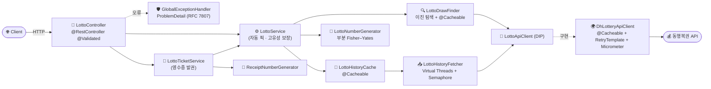

<div align="center">

# 🎰 Lotto Generator

**동행복권 공식 API 연동 · Spring Boot 4 · Java 21 Virtual Threads 기반 로또 번호 생성기**

역대 당첨번호 제외 고유 조합 · 영수증 형태 발권 · 수동 번호 입력 · 가상 스레드 fan-out · 레벨별 로그 분리

[](https://openjdk.org/projects/jdk/21/)
[](https://spring.io/projects/spring-boot)
[](https://gradle.org/)
[](#-테스트)

</div>

---

## 📑 목차

- [✨ 주요 특징](#-주요-특징)
- [🚀 빠른 시작](#-빠른-시작)
- [🛠 기술 스택](#-기술-스택)
- [🏛 아키텍처](#-아키텍처)
- [🎯 스프링 5원칙 적용](#-스프링-5원칙-적용)
- [🧠 핵심 설계](#-핵심-설계)
- [📁 패키지 구조](#-패키지-구조)
- [⚙️ 설정](#️-설정)
- [📝 로깅 전략](#-로깅-전략)
- [🔌 API 명세](#-api-명세)
- [🖥 프론트엔드](#-프론트엔드)
- [🧪 테스트](#-테스트)
- [📊 관측성](#-관측성)
- [▶️ 실행](#️-실행)

---

## ✨ 주요 특징

| 영역 | 핵심 |
|---|---|
| 🧵 **Java 21 Virtual Threads** | 회차별 fan-out을 가상 스레드로 처리, `Semaphore`로 외부 API 동시 호출 수 제한 |
| 🔍 **이진 탐색 최신 회차 탐지** | 지수 확장(×2) + 이진 탐색으로 O(log n) 호출만에 최신 회차 확정 |
| 🚫 **역대 당첨번호 제외 생성** | 1,100여 회차 누적 조합과 대조하여 고유 번호만 반환 |
| 🧾 **영수증 발권 모드** | 동행복권 영수증 포맷 그대로(라벨 A~ZZ · 발행시각 · 추첨일 · 청구마감일) |
| ✍️ **수동 번호 입력** | `manualNumbers` 파라미터로 사용자 직접 입력, 자동 픽과 자유 조합 |
| 🔁 **외부 API 재시도** | `RetryTemplate` 지수 백오프 (네트워크 일시 장애만 재시도) |
| 💾 **3계층 캐싱** | Caffeine — `lottoDraws`(7d) · `latestDraw`(30m) · `historyWinners`(7d) |
| 📋 **RFC 7807 ProblemDetail** | 검증/타입/필수파라미터/형식/리소스/일반 오류 일관 응답 |
| 📊 **Micrometer 메트릭** | `lotto.api.fetch` (P50/P95/P99 latency), `lotto.api.fail` 실패 카운트 |
| 📝 **레벨별 로그 분리** | TRACE/DEBUG/INFO/WARN/ERROR/ALL 6개 파일 + gzip 롤링 |
| 🌱 **프로파일 분리** | `dev`(전체 노출/DEBUG) · `prod`(최소 노출/WARN+) |
| ♿ **접근성 친화 UI** | `aria-busy` · `role="alert"` · `:focus-visible` · XSS 안전 |

---

## 🚀 빠른 시작

```powershell
# 1) 빌드 + 실행 (기본 dev 프로파일)
.\gradlew.bat bootRun

# 2) 브라우저에서 영수증 UI
# http://localhost:8080/

# 3) API 호출
curl "http://localhost:8080/api/lotto/ticket?games=5"
```

> 💡 `skipHistory=true`(기본) 발권은 외부 API를 호출하지 않아 즉시 응답합니다.
> `skipHistory=false` 모드는 동행복권 1~N회차를 fan-out 수집하므로 **첫 호출 시 수 초** 소요(이후 캐시).

---

## 🛠 기술 스택

| 항목 | 버전 / 사양 |
|---|---|
| **Java** | 21 LTS (Virtual Threads · Records) |
| **Spring Boot** | 4.0.6 |
| **Build** | Gradle 9.4.1 (Kotlin DSL) |
| **HTTP Client** | Spring `RestClient` + JDK `HttpClient` (HTTP/2) |
| **Cache** | Spring Cache + Caffeine (`recordStats` 활성) |
| **Resilience** | Spring Retry 2.0.10 (`RetryTemplate`) |
| **Validation** | Jakarta Bean Validation |
| **Observability** | Spring Actuator + Micrometer Timer |
| **Logging** | Logback (레벨별 RollingFileAppender + gzip) |
| **Lombok** | `@RequiredArgsConstructor` · `@Slf4j` |
| **Testing** | JUnit 5 + Mockito + MockMvc Standalone |

---

## 🏛 아키텍처



요청 흐름은 **컨트롤러 → 애플리케이션 서비스 → 도메인 협력자 → 추상화된 외부 API 클라이언트** 순으로 단방향 의존을 유지합니다. 자동 픽 생성 경로는 `LottoService.generate()` 단일 진입점으로 통합되어 `LottoTicketService`도 같은 경로를 재사용합니다.

---

## 🎯 스프링 5원칙 적용

### 1️⃣ IoC
`@SpringBootApplication` + `@ConfigurationPropertiesScan`으로 컴포넌트/설정 탐색을 컨테이너에 위임.

### 2️⃣ DI
Lombok `@RequiredArgsConstructor` 기반 **생성자 주입**. 모든 협력자를 `final`로 선언해 불변성 강제.

```java
@Service
@RequiredArgsConstructor
public class LottoService {
    private final LottoDrawFinder lottoDrawFinder;
    private final LottoHistoryCache lottoHistoryCache;
    private final LottoNumberGenerator lottoNumberGenerator;
}
```

### 3️⃣ AOP
`@Cacheable`로 외부 API 응답·역대 당첨 Set을 횡단 관심사로 분리. `@RestControllerAdvice`로 예외 처리도 횡단 분리.

### 4️⃣ PSA
- `LottoApiClient` 인터페이스로 외부 API 의존성 추상화(DIP). 구현체 교체 시 서비스 무변경.
- HTTP는 Spring `RestClient`(PSA), 캐시는 Spring Cache(PSA), 재시도는 Spring Retry(PSA), 메트릭은 Micrometer(PSA).

### 5️⃣ POJO
도메인(`LottoNumbers`, `LottoTicket`, `TicketGame`, `LottoDrawResponse`)을 **Java record**로 표현 — 부수효과 없는 불변 값 객체.

---

## 🧠 핵심 설계

### 🧵 Virtual Threads + Semaphore 기반 fan-out

```text
LottoHistoryFetcher
  └─ Executors.newVirtualThreadPerTaskExecutor()
       ├─ Semaphore(lotto.api.max-concurrent = 50)  ← 외부 API 보호
       └─ DhLotteryApiClient.@Cacheable             ← 회차별 응답 캐시
```

가상 스레드는 수천 개 생성해도 부담이 적지만, **외부 API 동시 호출 수만 별도로 제한**하여 동행복권 서버 정책을 준수합니다. 동시 한도는 `lotto.api.max-concurrent`로 외부화되어 재배포 없이 조정 가능합니다.

### 🔍 이진 탐색으로 최신 회차 탐지

```text
[1100] OK → 상한 지수 확장 (1200 → 1400 → 1800 → 2600 ...)
                    ↓
              최초 404 발견
                    ↓
        [low, high] 이진 탐색으로 좁힘
                    ↓
              최신 회차 확정 (30분 캐시)
```

선형 증가 대신 **지수 확장**으로 호출 횟수를 O(log n)에 묶고, 결과는 `latestDraw` 캐시(30분 TTL)에 저장.

### 💾 3계층 캐싱 전략

| 캐시 | 키 | TTL | 용도 |
|---|---|---|---|
| `lottoDraws` | `drawNo` | 7일 | 회차별 응답 (영구 불변 데이터) |
| `latestDraw` | (none) | 30분 | 최신 회차 번호 (주 1회 갱신) |
| `historyWinners` | `latestDraw` | 7일 | 역대 당첨 Set 자체 (fan-out 결과 통째 메모이즈) |

`historyWinners` 추가로 **같은 회차 기준 반복 요청 시 fan-out 자체를 생략**합니다.

### 🔁 외부 API 재시도 (Spring Retry)

```java
SimpleRetryPolicy(maxAttempts = 3,
                  retryableExceptions = { ResourceAccessException.class })
ExponentialBackOffPolicy(initial = 200ms, multiplier = 2.0, max = 2s)
```

- **네트워크/타임아웃만 재시도** (404·4xx·5xx는 재시도 X)
- `@Cacheable`(외곽) → `RetryTemplate`(내부) 순서를 명시적으로 보장하여 AOP 어드바이스 순서 모호성 제거.

### 🎲 부분 Fisher–Yates 셔플

매 호출 풀 전체 셔플 대신 **앞 `pickSize` 슬롯만 swap** → 호출당 swap 수 `O(45) → O(6)`로 감소.

### 🚫 고유 번호 생성 안전망

`LottoService.generateUnique()`는 `count × 1000`회를 초과하면 `IllegalStateException`으로 무한 루프 방지.

### 📋 RFC 7807 ProblemDetail 일관 응답

```json
{
  "type": "urn:problem-type:lotto/type-mismatch",
  "title": "파라미터 형식 오류",
  "status": 400,
  "detail": "파라미터 'count' 의 형식이 올바르지 않습니다. (요구 타입: Integer)"
}
```

처리 핸들러: `IllegalArgumentException` · `ConstraintViolationException` · `MethodArgumentTypeMismatchException` · `MissingServletRequestParameterException` · `HttpMessageNotReadableException` · `IllegalStateException` · `NoResourceFoundException` · `Exception`(fallback).

---

## 📁 패키지 구조

```
com.lotto
├── LottoApplication                  # @SpringBootApplication + @ConfigurationPropertiesScan
│
├── config/
│   ├── LottoProperties               # @ConfigurationProperties(prefix="lotto") record + @Validated
│   │   ├── Api                       #   ↳ baseUrl/method/timeouts/maxConcurrent/Retry
│   │   │   └── Retry                 #     ↳ maxAttempts/initialInterval/multiplier/maxInterval
│   │   ├── Draw                      #   ↳ searchStart/searchStep
│   │   ├── Generator                 #   ↳ defaultCount/maxCount/numberMin/numberMax/pickSize
│   │   └── Ticket                    #   ↳ pricePerGame/claimValidityDays
│   └── RestClientConfig              # @EnableCaching · RestClient Bean · Caffeine 3캐시
│
├── client/
│   ├── LottoApiClient                # 인터페이스 (DIP)
│   ├── DhLotteryApiClient            # 어댑터: @Cacheable + RetryTemplate + Micrometer
│   └── dto/
│       └── LottoDrawResponse         # 동행복권 응답 record
│
├── domain/
│   ├── LottoNumbers                  # 6개 번호 record + 단일 패스 검증 + parse()
│   ├── LottoNumberGenerator          # 부분 Fisher–Yates @Component
│   ├── PickMode                      # MANUAL/AUTO enum + 한국어 라벨
│   ├── TicketGame                    # 게임 한 줄 + labelFor() (A~ZZ, 702개)
│   ├── LottoTicket                   # 영수증 도메인 record
│   └── ReceiptNumberGenerator        # 5자리×6 영수증 번호 @Component
│
├── service/
│   ├── LottoDrawFinder               # 최신 회차 이진 탐색 @Cacheable
│   ├── LottoHistoryFetcher           # 1~N 회차 fan-out (Virtual Threads + Semaphore)
│   ├── LottoHistoryCache             # 역대 당첨 Set 자체 @Cacheable
│   ├── LottoService                  # Facade: 자동 픽 단일 진입점 (skipHistory 분기)
│   └── LottoTicketService            # 영수증 발권: 라벨/모드/일자/가격 조립
│
└── controller/
    ├── LottoController               # /api/lotto/{generate, ticket} @Validated
    ├── GlobalExceptionHandler        # 8종 예외 → ProblemDetail
    └── dto/
        ├── GenerateLottoResponse     # 번호 생성 응답
        └── TicketResponse            # 영수증 응답 (한국어 포맷팅)
```

---

## ⚙️ 설정

`src/main/resources/application.yml` (공통) + `application-dev.yml` / `application-prod.yml` (프로파일별).
모든 값은 `LottoProperties` record에 **타입 안전하게 바인딩** + Bean Validation 적용.

```yaml
spring:
  profiles:
    active: ${SPRING_PROFILES_ACTIVE:dev}
  threads:
    virtual:
      enabled: true                       # ← 가상 스레드 활성화

logging:
  file:
    path: logs                            # ← 로그 디렉터리 (logback-spring.xml)

lotto:
  api:
    base-url: https://www.dhlottery.co.kr/common.do
    method: getLottoNumber
    connect-timeout: 3s
    read-timeout: 5s
    max-concurrent: 50                    # ← Semaphore 한도
    retry:
      max-attempts: 3
      initial-interval: 200ms
      multiplier: 2.0
      max-interval: 2s
  draw:
    search-start: 1100                    # ← 이진 탐색 시작점
    search-step: 100
  generator:
    default-count: 5
    max-count: 50
    number-min: 1
    number-max: 45
    pick-size: 6
  ticket:
    price-per-game: 1000
    claim-validity-days: 365
```

### 프로파일별 차이

| 항목 | `dev` | `prod` |
|---|---|---|
| Actuator 노출 | `health, info, metrics, beans, env, mappings, caches, loggers` | `health, info, metrics` |
| Health 상세 | `always` | `when_authorized` |
| Root 로그 레벨 | `INFO` | `WARN` |
| `com.lotto` 로그 | `DEBUG` | `INFO` |

---

## 📝 로깅 전략

`logback-spring.xml`로 **레벨별 단독 파일 분리** + 통합 파일 동시 운영.

### 출력 구조

```
logs/
├── lotto-trace.log     # TRACE 전용
├── lotto-debug.log     # DEBUG 전용
├── lotto-info.log      # INFO 전용
├── lotto-warn.log      # WARN 전용
├── lotto-error.log     # ERROR 전용
├── lotto-all.log       # 전 레벨 통합 (디버깅 편의)
└── archive/
    └── lotto-{level}.YYYY-MM-DD.N.log.gz   # 롤링 산출물 (gzip)
```

### 정책

| 항목 | 값 |
|---|---|
| 레벨 격리 | `LevelFilter` ACCEPT/DENY → 한 파일에 한 레벨만 |
| 롤링 | 일자별 + 파일당 **10MB** 초과 시 분할 |
| 보존 | **30일**, 누적 **1GB** 상한 (통합 파일은 14일/2GB) |
| 압축 | 롤링 시 **gzip** 자동 |
| 콘솔 | 모든 프로파일에서 동시 출력 |
| 인코딩 | UTF-8 |
| 핫 리로드 | `scan="true" scanPeriod="30 seconds"` |

### 프로파일별 활성 appender

| 프로파일 | Root | `com.lotto` | 활성 파일 |
|---|---|---|---|
| `dev` | DEBUG | DEBUG | TRACE/DEBUG/INFO/WARN/ERROR/ALL |
| `prod` | INFO | INFO | INFO/WARN/ERROR/ALL |
| 기본/test | INFO | DEBUG | DEBUG/INFO/WARN/ERROR/ALL |

### 환경 변수로 경로 변경

```powershell
$env:LOG_PATH="C:\custom\path"; .\gradlew.bat bootRun
```

### 런타임 로그 레벨 변경 (Actuator Loggers)

```powershell
curl -X POST http://localhost:8080/actuator/loggers/com.lotto `
  -H "Content-Type: application/json" `
  -d '{\"configuredLevel\":\"TRACE\"}'
```

---

## 🔌 API 명세

### `GET /api/lotto/generate` — 번호 생성 (역대 당첨 제외)

| 파라미터 | 타입 | 범위 | 기본값 | 설명 |
|---|---|---|---|---|
| `count` | Integer | 1~50 | 5 | 생성할 조합 수 |

**응답**

```json
{
  "latestDraw": 1175,
  "historicalWinnerCount": 1175,
  "count": 5,
  "generatedNumbers": [[3, 11, 22, 28, 33, 41]],
  "formattedNumbers": ["[ 3, 11, 22, 28, 33, 41]"]
}
```

---

### `GET /api/lotto/ticket` — 영수증(티켓) 발권

| 파라미터 | 타입 | 범위 | 기본값 | 설명 |
|---|---|---|---|---|
| `games` | Integer | 1~50 | 5 | 총 게임 수 |
| `manual` | Integer | 0~50 | 0 | 수동 라벨 게임 수 |
| `manualNumbers` | List\<String\> | — | — | 수동 입력 번호. 항목당 6개 정수, 콤마/공백/세미콜론/하이픈 구분 |
| `skipHistory` | boolean | — | `true` | `false` 시 역대 당첨 제외 (느림) |

**수동 입력 예시**

```http
GET /api/lotto/ticket?games=5&manualNumbers=1,2,3,4,5,6&manualNumbers=7-8-9-10-11-12
```

`manualNumbers`가 제공되면 그 개수가 자동으로 수동 슬롯 수가 됩니다 (`manual` 파라미터는 무시).

**응답**

```json
{
  "title": "로또6/45",
  "round": 1176,
  "issuedAt": "2026/04/29 (수) 14:30:00",
  "drawDate": "2026/05/02",
  "claimDeadline": "2027/05/02",
  "receiptNumber": "68765 57128 51424 59983 79420 00166",
  "games": [
    { "label": "A", "mode": "MANUAL", "modeLabel": "수동", "numbers": [1, 2, 3, 4, 5, 6] },
    { "label": "B", "mode": "AUTO",   "modeLabel": "자동", "numbers": [7, 15, 24, 30, 38, 44] }
  ],
  "price": { "unit": 1000, "total": 5000, "currency": "원" }
}
```

> 🏷 **게임 라벨**: `A`~`Z` → `AA`~`ZZ` (총 702개 지원). 운영 한도는 `max-count=50`.

---

### Actuator

| 엔드포인트 | dev | prod | 용도 |
|---|---|---|---|
| `GET /actuator/health` | ✅ | ✅ | 헬스 체크 |
| `GET /actuator/info` | ✅ | ✅ | 빌드 정보 |
| `GET /actuator/metrics` | ✅ | ✅ | JVM/Cache/HTTP/Custom 메트릭 |
| `GET /actuator/loggers` | ✅ | ❌ | 런타임 로그 레벨 |
| `GET /actuator/caches` | ✅ | ❌ | Caffeine 통계 |
| `GET /actuator/beans` · `env` · `mappings` | ✅ | ❌ | 디버그 |

---

## 🖥 프론트엔드

`src/main/resources/static/` 정적 리소스로 통합된 **영수증 UI**.

```
static/
├── index.html      # 영수증 뷰 (단일 페이지)
├── js/ticket.js    # 바닐라 JS — fetch · AbortController · 디바운스 · 상태 관리
└── css/ticket.css  # 동행복권 영수증 디자인 + 다크모드/프린트/접근성
```

🌐 `http://localhost:8080/`

### UX 특징

- 🔁 **`AbortController`**로 중복 요청 자동 취소
- ⏳ 발권 중 버튼 비활성화 + `aria-busy` 반영
- 💀 스켈레톤 로딩 애니메이션
- ⚠️ 인라인 에러 박스 + 재시도 버튼 (`role="alert"`)
- 🖨 인쇄 버튼 (`window.print()`) — 컨트롤은 `@media print`에서 숨김
- ✍️ `<details>` 접이식 textarea로 수동 번호 입력
- 🛡 **XSS 안전**: 모든 서버 데이터는 `textContent`만 사용 (`innerHTML` 미사용)
- ⌨️ `:focus-visible` 키보드 포커스 링

---

## 🧪 테스트

### 구성 (총 20 테스트, 7 클래스)

| 테스트 클래스 | 영역 | 케이스 수 |
|---|---|---|
| `LottoNumbersTest` | 도메인 검증 (null/범위/중복/개수) | 6 |
| `LottoNumberGeneratorTest` | 100회 생성 무결성/통계 | 3 |
| `ReceiptNumberGeneratorTest` | 영수증 포맷 | 1 |
| `LottoDrawFinderTest` | 이진 탐색 시나리오 | 2 |
| `LottoTicketServiceTest` | 수동/자동 슬롯 배치 · 예외 경로 | 4 |
| `LottoControllerTest` | MockMvc Standalone + ProblemDetail | 3 |
| `LottoApplicationTests` | 컨텍스트 로딩 회귀 | 1 |

### 실행

```powershell
.\gradlew.bat test
```

리포트: `build/reports/tests/test/index.html`

### 테스트 설계 메모

- **MockMvc Standalone**: Spring Boot 4에서 `@WebMvcTest` 슬라이스가 제거됨에 따라 `MockMvcBuilders.standaloneSetup` + `@RestControllerAdvice` 직접 등록 방식으로 가볍게 검증.
- **메서드 검증 AOP 미활성**: standalone 환경에서는 `@Validated` 메서드 검증 어드바이스가 동작하지 않으므로 `@Min/@Max` 위반 케이스는 통합 테스트에 위임.

---

## 📊 관측성

### Custom Metrics (Micrometer)

| 메트릭 | 타입 | 태그/퍼센타일 | 설명 |
|---|---|---|---|
| `lotto.api.fetch` | Timer | P50/P95/P99 | 동행복권 회차 조회 latency |
| `lotto.api.fail` | Timer | — | 회차 조회 실패 횟수 |

### Caffeine 통계 (`recordStats`)

3개 캐시(`lottoDraws`/`latestDraw`/`historyWinners`) 모두 통계 활성화 → `/actuator/caches`에서 hit ratio · eviction count 확인 가능.

```powershell
curl http://localhost:8080/actuator/metrics/lotto.api.fetch
curl http://localhost:8080/actuator/caches
```

---

## ▶️ 실행

### 빌드 & 실행

```powershell
# dev 프로파일 (기본)
.\gradlew.bat bootRun

# prod 프로파일
$env:SPRING_PROFILES_ACTIVE="prod"; .\gradlew.bat bootRun

# 프로덕션 jar 빌드
.\gradlew.bat clean build
java -jar build/libs/ch01-1.0-SNAPSHOT.jar --spring.profiles.active=prod
```

### 호출 예시

```powershell
# ⚡ 빠른 영수증 발권 (외부 API 미호출)
curl "http://localhost:8080/api/lotto/ticket?games=5"

# 🐢 역대 당첨 제외 발권 (첫 호출만 수 초)
curl "http://localhost:8080/api/lotto/ticket?games=5&skipHistory=false"

# 🧾 수동 1게임 + 자동 4게임
curl "http://localhost:8080/api/lotto/ticket?games=5&manualNumbers=1,2,3,4,5,6"

# 🎲 번호 생성 (역대 당첨 제외)
curl "http://localhost:8080/api/lotto/generate?count=5"

# 📊 메트릭/캐시 통계 조회
curl http://localhost:8080/actuator/metrics/lotto.api.fetch
curl http://localhost:8080/actuator/caches
```

---

## 📜 라이선스

학습/포트폴리오 목적의 개인 프로젝트 — 내부 사용 자유.

---

<div align="center">

**Built with ☕ Java 21 · 🌱 Spring Boot 4 · 🐘 Gradle 9 · 📋 RFC 7807**

🎰 *재미는 가볍게, 코드는 진지하게* 🎰

</div>

